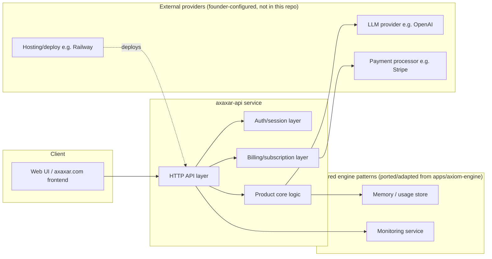

# Axaxar.com — proposed architecture (DRAFT, for review)

**Status:** Draft, unapproved. Written to give the founder a concrete
technical shape to react to, edit, or replace — not a locked decision.

See `docs/keystone/AXAXAR_LAUNCH_PLAN.md` in `keystone-eternal-seed` for the
stated assumption this draft is built on (Axaxar.com as a paid/subscription
AI-assisted product, distinct from the free public AXIOM chat) and for the
open questions that must be answered before this becomes a real build.

## Design goals

1. **Reuse what's already proven**, don't reinvent it. `apps/axiom-engine` in
   `keystone-eternal-seed` already has a tested chat service, append-only
   memory store, usage metering, and monitoring. Axaxar should start from
   those patterns rather than duplicate them from scratch.
2. **Separate the product from the free AXIOM chat.** Axaxar is a distinct
   commercial surface — its own service, its own auth, its own billing — even
   if it shares library code or engine patterns with `axiom-engine`.
3. **No secrets in the repo, ever.** All provider keys, billing keys, and
   admin passwords are environment variables, following the existing
   `apps/axiom-engine/.env.example` convention.
4. **Everything reversible until Phase 6 (launch).** No production traffic,
   no real customer billing, until the founder explicitly approves go-live.

## Proposed high-level architecture



## Proposed service layout (skeleton only — not yet built)

```
axaxar.com/
├── apps/
│   └── axaxar-api/          # Node.js/Express service (mirrors axiom-engine's shape)
│       ├── index.js         # HTTP entrypoint, route wiring
│       ├── auth-service.js  # user accounts/sessions
│       ├── billing-service.js  # subscription/usage billing, provider-agnostic interface
│       ├── product-service.js  # the actual product logic (depends on confirmed scope)
│       ├── memory-store.js  # adapted from apps/axiom-engine/memory-store.js if reused
│       ├── .env.example
│       ├── package.json
│       └── test/
├── docs/
│   └── (product-specific docs once scope is confirmed)
└── README.md
```

## Auth & billing: kept provider-agnostic

Until the founder confirms which payment processor and auth approach to use,
`auth-service.js` and `billing-service.js` should be written against small,
provider-agnostic interfaces (e.g. `createCustomer`, `createSubscription`,
`recordUsage`) with a single adapter module per real provider — the same way
`apps/axiom-engine/chat-service.js` isolates its one call to the OpenAI API.
This keeps the founder's provider choice (Stripe, Paddle, etc.) a
configuration/adapter decision, not a rewrite.

## Deployment

Mirror the existing, already-verified pattern in
`docs/RAILWAY_DEPLOYMENT.md` / `apps/axiom-engine/railway.json`: containerized
service, environment-variable configuration, health-check endpoint, staged
rollout (non-production environment first per the phase plan) before any
DNS cutover to the real `axaxar.com` domain.

## Explicitly out of scope for this draft

- Actual product feature design (depends on founder's answer to "what does
  Axaxar.com do for a paying user?").
- Domain purchase/DNS configuration.
- Payment-processor account creation.
- Legal entity / terms-of-service / privacy-policy drafting.
- Any deployment or spend.

## Next step

Founder review of this architecture and answers to the open questions in
`docs/keystone/AXAXAR_LAUNCH_PLAN.md` (in `keystone-eternal-seed`), then
Phase 2 (scaffold build) can begin.
